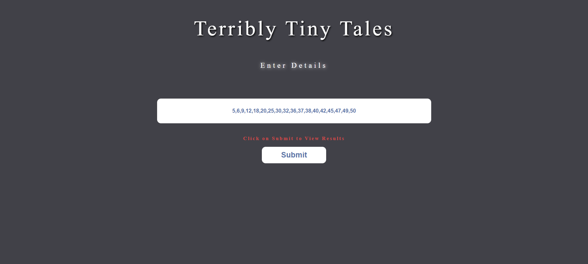
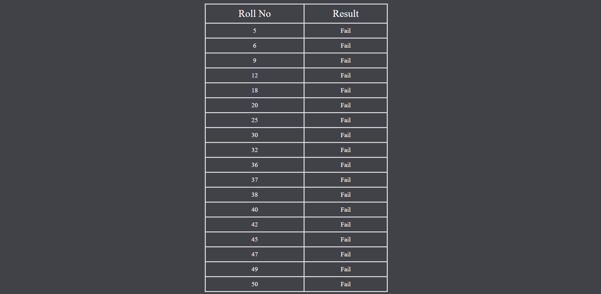
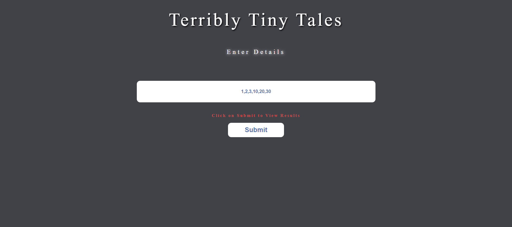
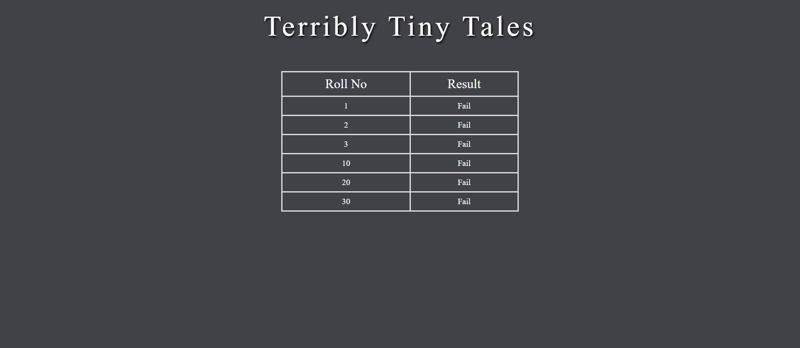

# Installation

* Clone the repository `git clone https://github.com/rvnarwal13/terribly-tiny-tales.git`
* Change the directory `cd terribly-tiny-tales`
* Run the server `npm start`
* The server is running at [localhost:3000](http://localhost:3000)

# Components of the code

This is the homepage which consists of the form through which we will pass the values to the API.  

This script changes the content of the button and disables it.  

Fetching the get (rollNo) query from the url and passing the roll numbers seperated by comma to an array. For splitting the string of roll numbers, split() is used with ',' as the delimeter.
Further the value of `roll` is checked for unefined value, null value and empty value. If it's true then "Invalid Query" is displayed or else the result is displayed in a tabular format.
The result data is stored in an array and passed to display.pug.  

Then the array passed to the dispaly.pug file is displayed in a tabular structure with foreach loop.

# Test Cases

## Test Case 1

### Data passed : `5,6,9,12,18,20,25,30,32,36,37,38,40,42,45,47,49,50`

### Output

## Test Case 2

### Data passed : `1,2,3,10,20,30`

### Output

# Libraries and Plugins 

* Node.js
* Expressjs
* Pug
* body-parser
* node-fetch